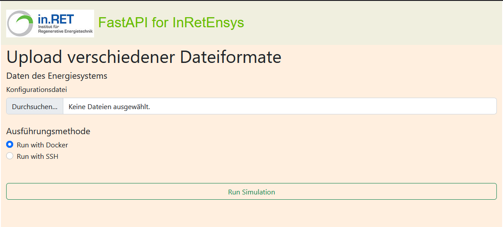
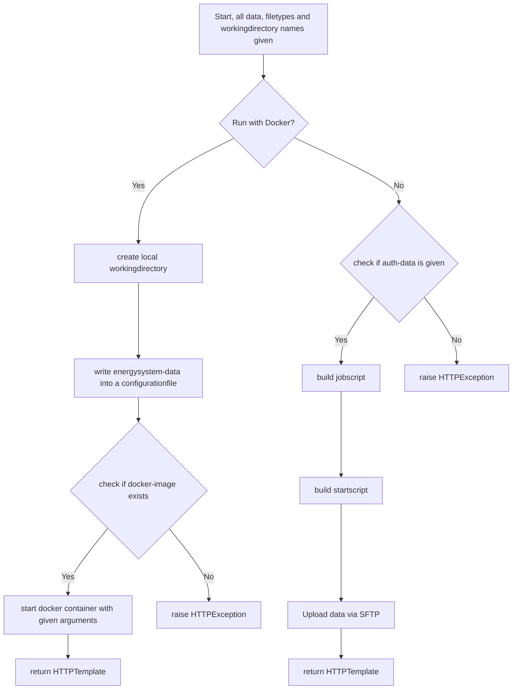

# Functions

## Public Functions

### URL: "/"
Generic root-path to render the mainpage.
To get an overview of the rendered page see the picture below.

<figure markdown>
  
  <figcaption>Example-GUI for the given API</figcaption>
</figure>

### URL: "/uploadFile"
This path is used by websites which provide a graphical user interface, like the root path of these API.

The python function reads all provided datafiles in and runs the simulations depending on the flag 'docker' which is a radio box on the given gui. (See the picture above.)


### URL: "/uploadJson"
This path is used the send post-requests where the energysystem is an json-formatted string as data of the request.

The python function wraps all given data to the private function 'run_simulation(..)' and returns the given website or HTTPException.
All created folders and their names are returned as a Jinja2-Template which is based on the template from the generic path.

Every request create one workingdirectory for an energysystem. 
It is not possible to submit more than one energysystem within one request.

## Private Functions

### generate_random_folder()
```python
import uuid

def generate_random_folder():
    return str(uuid.uuid4().hex)
```
This is a simple helper function to generate an uuid in hex to name and later create folders as workingdirectory.
uuid is used to guarantee a unique name.

### run_simulation(..)

#### Overview
The function 'run_simulation' creates all needed workingdirectories - locally or external, creates the given docker-containers with all arguments to run or upload the data to the UniRZ and create a startscript for the user to start solving all submitted energysystems at once.

!!! note
    UniRZ = Universitätsrechenzentrum Ilmenau

#### Deep Dive
From the functions above ("uploadFile" and "uploadJson") given data are tuples. 
These tuples contains the filedata and the filetype.

To create Containers or upload all data it is necessary to loop through these inputdata.

```python
for datafile, ftype in input:
    ...
```

At this point the algorithm has two variables, a datafile and the filetype of these datafile.
The not given path or name for the working directory is now created by the function "generate_random_folder" from above.

The graph below shows the following steps of the code.



If the Data is written to the UniRZ the user must start the given script on his own via the interface of the UniRZ.

